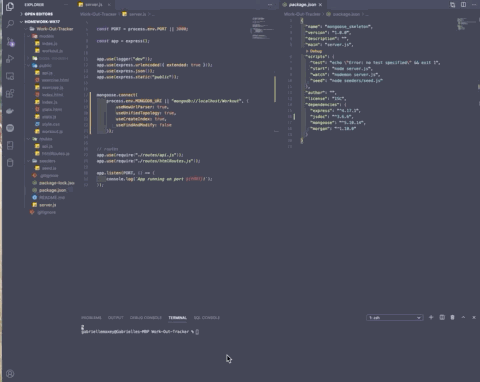
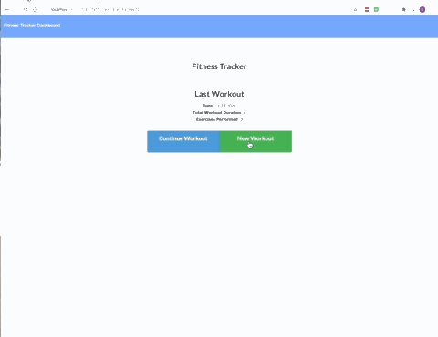
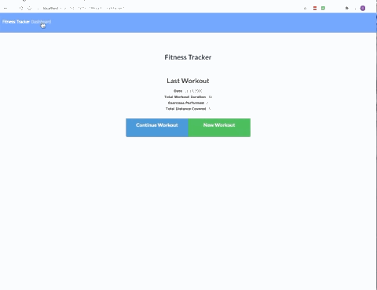

  

  # Work-Out-Tracker

  ## Description
 This application provides a platform for users to enter and track daily workouts. Users can log multiple workouts on a given day and then view a graph of their progress.

*Start application*      
 

*Enter exercise*      
 

*Workout Dashboard*       
 

## Deployed Webiste
https://intense-eyrie-50005.herokuapp.com/

  ## Table of Contents
  * [Description](#Description)
  * [Deployed Website](#Deployed)
  * [Installation](#Installation)
  * [Usage](#Usage)
  * [Contributing](#Contributing)
  * [Questions](#Questions)
  * [Author](#Author)
  * [License](#License)

  ## Installation
  Run via Node.js with npm dependencies: mongoose, express, morgan

 ## Usage
  Once you've forked the repository and cloned into your personal directory, you'll intall the necessary dependencies and have MongoDB running you'll enter the command 'npm start' to begin use.

  ## Contributing
  Individuals may contribute by contacting the author directly.

 
 

  ## Questions
  Please send any questions or comments to the author listed below.

  ## Author:
  Gabrielle Maxey

  Email: gmaxeyg@gmail.com

  Github: <https://github.com/GabrielleM45>

  ## License
  *This application is Licensed under the following license:*\
  **[mit](https://choosealicense.com/licenses/mit/)**

